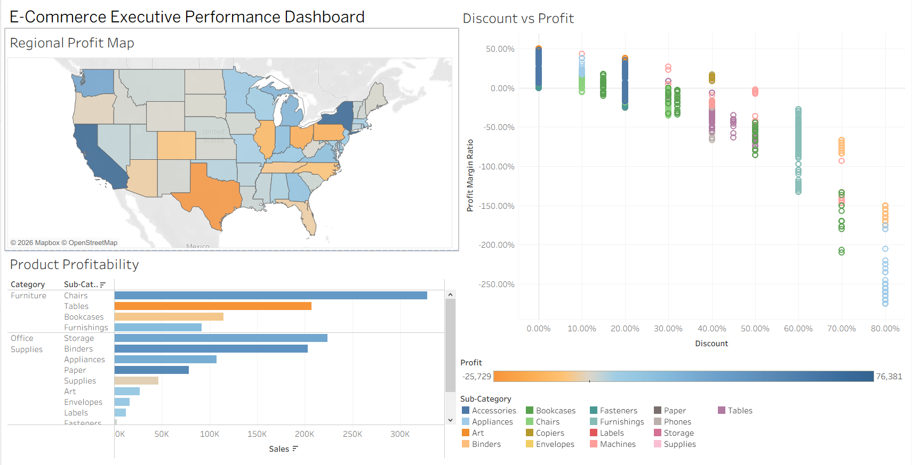

# E-Commerce Sales & Profit Leakage Analysis

An end-to-end business intelligence project analyzing retail revenue, discount strategies, and regional profit drivers using Excel, Power Query, and Tableau Public.

---

## 📌 Live Interactive Dashboard

[Link to Tableau Public Dashboard](https://public.tableau.com/app/profile/hasan.shaheen/viz/E-CommerceSalesProfitabilityAnalysis/Dashboard1?publish=yes)

---

## 🛠️ Data Pipeline & Transformation

Data was extracted, transformed, and cleaned in **Excel Power Query** prior to visualization in **Tableau Public**:

* **Data Hygiene & Types:** Standardized text attributes, validated dates using US locale settings (`MM/DD/YYYY`), and converted currency and postal metrics.
* **Line-Item Integrity:** Maintained duplicate `Order ID` entries across distinct product lines to ensure accurate basket analysis without dropping items.
* **Feature Engineering:**
  * `Profit Margin`: Calculated dynamic profit ratios (`[Profit] / [Sales]`).
  * `Days to Ship`: Derived fulfillment duration (`Duration.Days([Ship Date] - [Order Date])`).

---

## 📊 Dashboard Visualizations & Structure

Built in **Tableau Public** using custom calculated measures:

* **Regional Profit Map:** Geographic visualization revealing negative profit margins across specific territories despite high sales volume.
* **Product Profitability:** Categorical breakdown identifying specific sub-categories (e.g., Tables, Bookcases) operating at net losses.
* **Discount vs. Profitability Scatter Plot:** Disaggregated transaction plot evaluating discount threshold impacts on operating margins.

---

## 💡 Key Business Insights

1. **Regional Profit Leakage:** High sales volume in specific regions does not correlate with profitability, driven largely by aggressive regional pricing strategies and high fulfillment costs.
2. **Category Margin Loss:** Sub-categories such as **Tables** and **Bookcases** generate negative net profit overall due to steep initial markdowns.
3. **Discount Threshold Risk:** Transactional analysis proves that offering discounts above **20%** triggers a sharp downward slope directly into negative profit territory.

---

## 🎯 Operational Recommendations

* **Cap Promotional Discounts:** Restrict standard sales discount thresholds to a maximum of **15–20%** to safeguard operating margins.
* **Re-evaluate Shipping & Bundling for Heavy Items:** Adjust freight fee coverage on bulky furniture items (Tables/Bookcases) or shift toward minimum order thresholds.
* **Territory Strategy Realignment:** Shift regional sales focus from pure top-line revenue metrics to net contribution margin targets.
